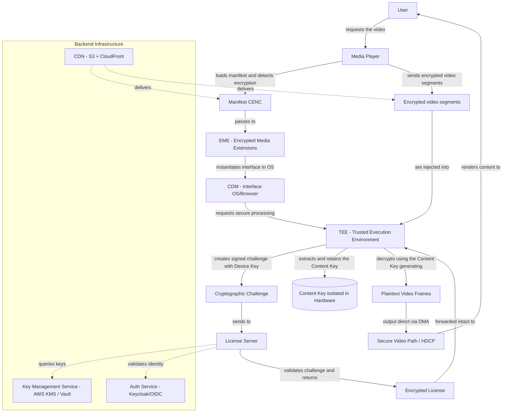

# Digital-Right-Management

To assemble a complete DRM (crypto-protection, key management, and license management) solution and organize everything into versioned repositories, with ready-to-use documentation so that the team – and new developers – can understand, compile, test, and operate the solution.

## Overview

## CDN (Content Delivery Network)

## License Server

## EME (Encrypted Media Extensions)

## CDM (Content Decryption Module) & TEE (Trusted Execution Environment)

## Output Protection / HDCP
